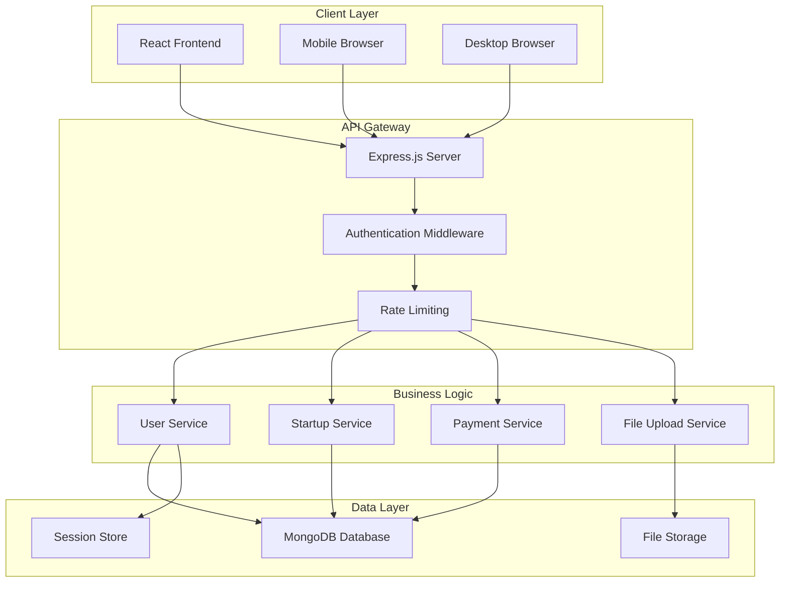

# Design Document: Startup Marketplace Platform

## Overview

The startup marketplace platform is a modern web application that facilitates connections between startup founders and potential buyers (entrepreneurs/investors). The platform follows a component-driven architecture using React for the frontend and Node.js/Express for the backend, with a focus on scalability, security, and user experience.

The system implements a three-tier architecture with clear separation between presentation, business logic, and data layers. The design emphasizes responsive design principles, secure payment processing, and efficient content management to create a trustworthy marketplace environment.

## Architecture

### System Architecture

The platform follows a modern full-stack architecture pattern:



### Technology Stack

**Frontend:**
- React 18+ with functional components and hooks
- React Router for client-side routing
- Styled Components or CSS Modules for styling
- Axios for API communication
- React Hook Form for form management

**Backend:**
- Node.js with Express.js framework
- MongoDB with Mongoose ODM
- JWT for authentication
- Multer for file uploads
- Stripe API for payment processing

**Infrastructure:**
- RESTful API design
- Responsive CSS Grid and Flexbox
- Progressive Web App (PWA) capabilities
- SEO optimization with meta tags

## Components and Interfaces

### Frontend Components

#### Core Layout Components

**Header Component**
- Navigation menu with conditional rendering based on authentication state
- Logo and branding elements
- User profile dropdown for authenticated users
- Mobile-responsive hamburger menu

**Footer Component**
- Links to key pages (About, Contact, Pricing)
- Social media links
- Copyright and legal information

**Layout Wrapper**
- Consistent page structure
- Loading states and error boundaries
- Toast notification system

#### Page Components

**HomePage Component**
- Hero section with value proposition
- Call-to-action buttons with routing
- Featured startups carousel
- How it works section with step indicators
- Testimonials section

**ExplorePage Component**
- Startup listing grid with pagination
- Filter sidebar with category, price, and industry filters
- Search functionality with debounced input
- Sort options (price, date, popularity)

**StartupCard Component**
- Startup information display
- Image gallery with fallback images
- Price/investment type badges
- Action buttons (View Details, Save)

**UploadPage Component**
- Multi-step form with validation
- File upload with drag-and-drop
- Progress indicators
- Form state management with auto-save

**Dashboard Component**
- User-specific content based on role
- Statistics and analytics widgets
- Quick action buttons
- Recent activity feed

#### Authentication Components

**LoginForm Component**
- Email/password input with validation
- Remember me functionality
- Social login options
- Password reset link

**SignupForm Component**
- Role selection (Founder/Buyer)
- Form validation with real-time feedback
- Terms of service acceptance
- Email verification flow

### Backend API Interfaces

#### Authentication Endpoints

```javascript
POST /api/auth/register
POST /api/auth/login
POST /api/auth/logout
POST /api/auth/refresh
GET /api/auth/verify-email/:token
```

#### User Management Endpoints

```javascript
GET /api/users/profile
PUT /api/users/profile
GET /api/users/dashboard
DELETE /api/users/account
```

#### Startup Management Endpoints

```javascript
GET /api/startups
POST /api/startups
GET /api/startups/:id
PUT /api/startups/:id
DELETE /api/startups/:id
GET /api/startups/search
GET /api/startups/featured
```

#### File Upload Endpoints

```javascript
POST /api/uploads/images
POST /api/uploads/documents
DELETE /api/uploads/:fileId
```

#### Payment Processing Endpoints

```javascript
POST /api/payments/create-intent
POST /api/payments/confirm
GET /api/payments/history
POST /api/payments/refund
```

## Data Models

### User Model

```javascript
{
  _id: ObjectId,
  email: String (unique, required),
  password: String (hashed, required),
  role: String (enum: ['founder', 'buyer'], required),
  profile: {
    firstName: String (required),
    lastName: String (required),
    company: String,
    bio: String,
    avatar: String (URL),
    phone: String,
    location: String
  },
  preferences: {
    industries: [String],
    priceRange: {
      min: Number,
      max: Number
    },
    notifications: {
      email: Boolean,
      push: Boolean
    }
  },
  verification: {
    email: Boolean (default: false),
    emailToken: String,
    phone: Boolean (default: false)
  },
  createdAt: Date,
  updatedAt: Date,
  lastLogin: Date
}
```

### Startup Model

```javascript
{
  _id: ObjectId,
  founder: ObjectId (ref: 'User', required),
  name: String (required),
  description: String (required),
  industry: String (required),
  category: String (required),
  pricing: {
    type: String (enum: ['sale', 'investment'], required),
    amount: Number (required),
    currency: String (default: 'USD'),
    negotiable: Boolean (default: true)
  },
  details: {
    stage: String (enum: ['idea', 'mvp', 'growth', 'established']),
    employees: Number,
    revenue: Number,
    founded: Date,
    location: String,
    website: String,
    technologies: [String]
  },
  media: {
    logo: String (URL),
    images: [String] (URLs),
    pitchDeck: String (URL),
    documents: [{
      name: String,
      url: String,
      type: String
    }]
  },
  metrics: {
    views: Number (default: 0),
    saves: Number (default: 0),
    inquiries: Number (default: 0)
  },
  status: String (enum: ['draft', 'active', 'sold', 'inactive'], default: 'draft'),
  featured: Boolean (default: false),
  createdAt: Date,
  updatedAt: Date
}
```

### Transaction Model

```javascript
{
  _id: ObjectId,
  startup: ObjectId (ref: 'Startup', required),
  buyer: ObjectId (ref: 'User', required),
  seller: ObjectId (ref: 'User', required),
  amount: Number (required),
  currency: String (default: 'USD'),
  type: String (enum: ['purchase', 'investment'], required),
  status: String (enum: ['pending', 'completed', 'failed', 'refunded'], default: 'pending'),
  paymentIntent: String (Stripe payment intent ID),
  platformFee: Number,
  netAmount: Number,
  metadata: {
    paymentMethod: String,
    processingFee: Number,
    notes: String
  },
  createdAt: Date,
  completedAt: Date
}
```

### Session Model

```javascript
{
  _id: ObjectId,
  userId: ObjectId (ref: 'User', required),
  token: String (required),
  refreshToken: String,
  deviceInfo: {
    userAgent: String,
    ip: String,
    location: String
  },
  expiresAt: Date,
  createdAt: Date
}
```

## Correctness Properties

*A property is a characteristic or behavior that should hold true across all valid executions of a system—essentially, a formal statement about what the system should do. Properties serve as the bridge between human-readable specifications and machine-verifiable correctness guarantees.*

### Property 1: User Registration and Authentication
*For any* valid user registration data, the system should create an account, authenticate the user, and redirect to the appropriate dashboard based on their role
**Validates: Requirements 1.2, 1.4**

### Property 2: Input Validation and Error Handling
*For any* invalid user input (registration, login, or form submission), the system should reject the input, display appropriate error messages, and maintain form state
**Validates: Requirements 1.3, 1.5, 2.3**

### Property 3: Startup Listing Creation and Management
*For any* valid startup information submitted by a founder, the system should create a new listing, store associated files securely, and make it visible to buyers
**Validates: Requirements 2.2, 2.4, 2.5**

### Property 4: Search and Filter Functionality
*For any* combination of filters (category, price range, industry), the system should return only startups that match all applied criteria
**Validates: Requirements 3.2, 3.3, 3.4**

### Property 5: Navigation and Routing
*For any* valid navigation action (clicking buttons, links, or cards), the system should navigate to the correct destination and display appropriate content
**Validates: Requirements 3.5**

### Property 6: Role-Based Dashboard Content
*For any* authenticated user, the dashboard should display content and functionality specific to their role (founder or buyer) and current account state
**Validates: Requirements 5.1, 5.2, 5.3, 5.5**

### Property 7: Profile Management
*For any* valid profile update, the system should save the changes, maintain data integrity, and confirm the update to the user
**Validates: Requirements 5.4**

### Property 8: Payment Processing Integrity
*For any* payment transaction, the system should process it securely, handle both success and failure cases appropriately, and support multiple transaction types
**Validates: Requirements 6.1, 6.2, 6.3, 6.4, 6.5**

### Property 9: Responsive Design Behavior
*For any* device type or screen size, the platform should display an appropriate layout that maintains functionality and visual consistency
**Validates: Requirements 7.1, 7.2, 7.3**

### Property 10: Design System Consistency
*For any* UI component or page, the platform should apply consistent styling, typography, and design patterns according to the specified design system
**Validates: Requirements 7.4, 7.5, 8.1**

### Property 11: Content Display Completeness
*For any* startup listing or card display, all required information should be present and properly formatted according to the content specifications
**Validates: Requirements 8.3**

### Property 12: File Upload and Optimization
*For any* uploaded image or document, the system should optimize it appropriately, store it securely, and display it correctly across all device sizes
**Validates: Requirements 8.2**

### Property 13: SEO Implementation
*For any* page on the platform, SEO-friendly URL structures and appropriate meta tags should be implemented for search engine optimization
**Validates: Requirements 8.4**

## Error Handling

### Client-Side Error Handling

**Form Validation Errors**
- Real-time validation with immediate feedback
- Field-level error messages with specific guidance
- Form state preservation during validation failures
- Accessibility compliance with ARIA labels

**Network and API Errors**
- Retry mechanisms for transient failures
- Graceful degradation for offline scenarios
- User-friendly error messages for different error types
- Loading states and progress indicators

**File Upload Errors**
- File size and type validation
- Upload progress tracking with cancellation options
- Error recovery for failed uploads
- Clear feedback for unsupported file formats

### Server-Side Error Handling

**Authentication and Authorization Errors**
- JWT token validation and refresh mechanisms
- Rate limiting for authentication attempts
- Secure error messages that don't leak sensitive information
- Session management and cleanup

**Database Operation Errors**
- Transaction rollback for failed operations
- Data validation at the model level
- Duplicate key handling for unique constraints
- Connection pooling and retry logic

**Payment Processing Errors**
- Stripe webhook handling for payment status updates
- Idempotency keys for payment operations
- Refund processing and reconciliation
- PCI compliance for sensitive data handling

**File Storage Errors**
- Cloud storage failover mechanisms
- File corruption detection and recovery
- Storage quota management
- Secure file access with signed URLs

## Testing Strategy

### Dual Testing Approach

The platform will implement both unit testing and property-based testing to ensure comprehensive coverage:

**Unit Tests** focus on:
- Specific examples and edge cases
- Integration points between components
- Error conditions and boundary cases
- Component rendering and user interactions

**Property Tests** focus on:
- Universal properties that hold for all inputs
- Comprehensive input coverage through randomization
- Business logic validation across all scenarios
- Data integrity and consistency checks

### Property-Based Testing Configuration

**Testing Framework**: Fast-check for JavaScript property-based testing
- Minimum 100 iterations per property test
- Each property test references its design document property
- Tag format: **Feature: startup-marketplace, Property {number}: {property_text}**

**Test Categories**:

1. **Authentication Properties**
   - User registration with valid/invalid data
   - Login credential validation
   - Session management and token handling

2. **Data Management Properties**
   - Startup listing creation and validation
   - File upload and storage integrity
   - Database operation consistency

3. **Business Logic Properties**
   - Search and filtering accuracy
   - Payment processing reliability
   - Role-based access control

4. **UI/UX Properties**
   - Responsive design behavior
   - Form validation and error handling
   - Navigation and routing correctness

### Unit Testing Balance

Unit tests complement property tests by providing:
- Concrete examples of expected behavior
- Regression testing for known issues
- Integration testing for component interactions
- Performance benchmarking for critical paths

The testing strategy avoids over-reliance on unit tests for input coverage, instead using property-based tests to handle the vast input space while unit tests focus on specific scenarios and integration points.

### Test Environment Setup

**Frontend Testing**:
- Jest and React Testing Library for component tests
- Cypress for end-to-end testing
- Fast-check for property-based testing
- Mock Service Worker for API mocking

**Backend Testing**:
- Jest for unit and integration tests
- Supertest for API endpoint testing
- MongoDB Memory Server for database testing
- Fast-check for property-based testing of business logic

**Continuous Integration**:
- Automated test execution on pull requests
- Code coverage reporting with minimum thresholds
- Performance regression testing
- Security vulnerability scanning